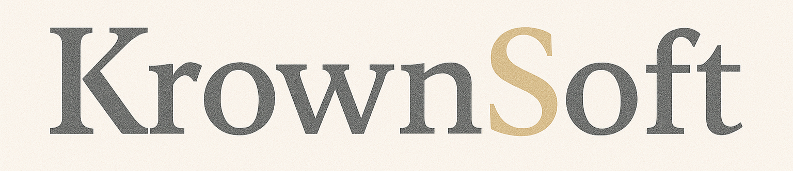
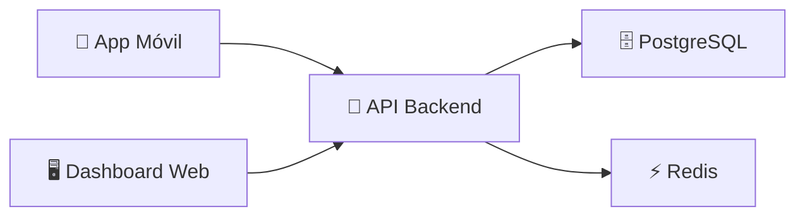

# 🚀 KrownSoft - Innovación en Software Empresarial

**Transformando empresas con soluciones tecnológicas de vanguardia**

---

## 🏢 Sobre Nosotros

**KrownSoft** es una empresa argentina especializada en desarrollo de software empresarial. Creamos soluciones tecnológicas innovadoras que transforman la gestión de operaciones empresariales.

### 🎯 Nuestra Misión

Democratizar el acceso a tecnología de vanguardia para empresas de todos los tamaños, proporcionando soluciones escalables, seguras y eficientes.

### 💡 Valores

- 🚀 **Innovación**: Tecnologías de vanguardia
- 🔒 **Seguridad**: Protección de datos prioritaria
- ⚡ **Performance**: Optimización constante
- 🤝 **Colaboración**: Trabajo conjunto con clientes
- 📈 **Escalabilidad**: Construimos para el futuro

---

## 💼 Servicios

### 🏭 Software Empresarial

- 📊 Gestión de operaciones y pedidos
- 👥 Administración de personal
- 📱 Aplicaciones móviles para empleados
- 📈 Analytics e inteligencia de negocios

### 🛠️ Desarrollo a Medida

- 🌐 **Frontend**: React, Angular, Vue.js
- 📱 **Móvil**: Flutter, React Native
- 🔧 **Backend**: FastAPI, Node.js, .NET
- 🗄️ **Bases de Datos**: PostgreSQL, MongoDB, Redis

### ☁️ DevOps & Cloud

- 🐳 Containerización con Docker
- 🔄 CI/CD con GitHub Actions
- ☁️ Despliegues en AWS, Azure, GCP
- 📊 Monitoreo y métricas

---

## 🌟 Proyecto Destacado: TaskFlow

### Sistema Integral de Gestión de Pedidos

**TaskFlow** es nuestro sistema insignia para gestión empresarial en tiempo real.

#### ✨ Características

- 📊 **Dashboard Administrativo** con React + TypeScript
- 📱 **App Móvil Multiplataforma** en Flutter
- ⚡ **Sincronización en Tiempo Real** con WebSocket
- 🔐 **Seguridad Avanzada** (JWT, AES-256, auditoría)
- 🤖 **Automatización Inteligente** y alertas
- 📈 **Analytics Completo** con métricas y KPIs

#### 🛠️ Stack Tecnológico

- **Frontend**: React 19 + TypeScript + TailwindCSS
- **Backend**: FastAPI + PostgreSQL + Redis
- **Móvil**: Flutter 3.8+ + Material Design 3
- **DevOps**: Docker + GitHub Actions + Nginx

---

## 📊 Métricas y Logros

**+50** Proyectos | **+20** Clientes | **+3** Años de Experiencia

### 🏆 Estándares de Calidad

- ✅ **+95%** Cobertura de tests
- ✅ **<200ms** Tiempo de respuesta promedio
- ✅ **99.9%** Uptime en producción
- ✅ **+1M** Transacciones mensuales

---

## 🚀 Tecnologías

### Frontend & Móvil

### Backend & Base de Datos

### DevOps & Cloud

---

## 🤝 Trabajemos Juntos

### 💼 Servicios que Ofrecemos

- 🚀 Desarrollo de software a medida
- 📱 Aplicaciones móviles multiplataforma
- 🌐 Sistemas web empresariales
- ☁️ Migración a la nube
- 🔧 Modernización de sistemas legacy
- 📊 Business intelligence y analytics

### 💡 ¿Por qué KrownSoft?

- ✅ **Experiencia Comprobada**: +3 años transformando empresas
- ✅ **Tecnología de Vanguardia**: Stack moderno y escalable
- ✅ **Soporte Continuo**: Acompañamiento post-lanzamiento
- ✅ **Calidad Garantizada**: Tests rigurosos y QA completo

---

## 📧 Contacto

**Hablemos de tu próximo proyecto:**

- 📧 **Email**: [contacto@krownsoft.com.ar](mailto:contacto@krownsoft.com.ar)
- 🌐 **Website**: [krownsoft.com.ar](https://krownsoft.com.ar)
- 💼 **LinkedIn**: [KrownSoft](https://linkedin.com/company/krownsoft)

---

**© 2024 KrownSoft - Transformando el futuro con tecnología**

_Hecho en Argentina 🇦🇷_

